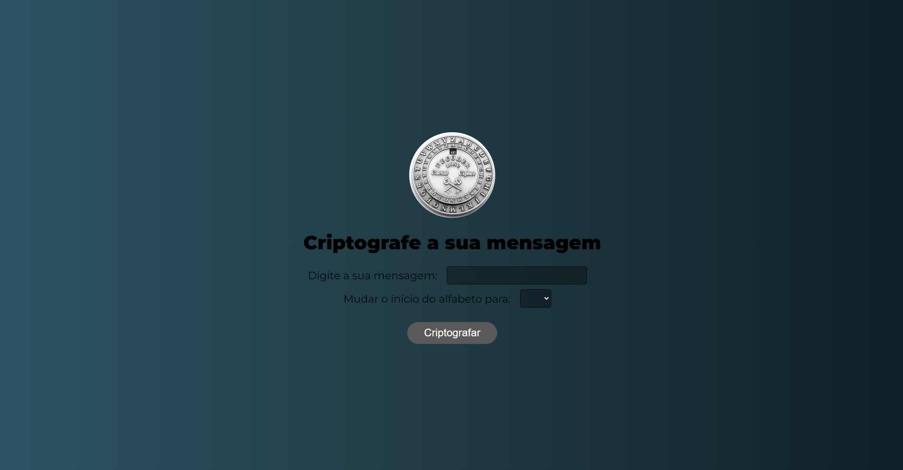
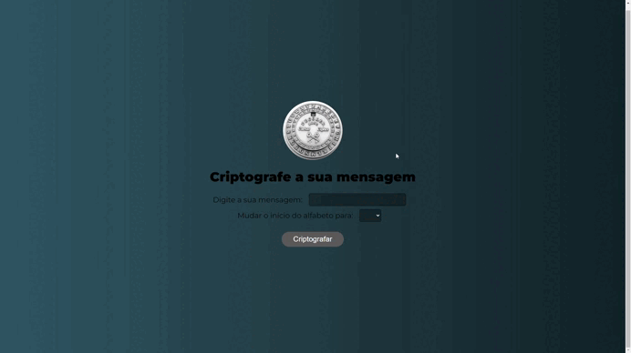

# Cifra de Cesar 🔑

## O que é esse projeto? 💭
Esse projeto é uma página feita com HTML, CSS e JS que contém um input para inserir uma mensagem, um select box para escolher de qual letra começar o alfabeto e um botão para criptografar.

## Como rodar esse projeto? 💻
Para rodar o projeto basta dar dois cliques no *index.html* uma vez que a pasta do projeto esteja aberta no sistema de arquivos do seu sistema operacional.

Alternativamente, você também pode usar a extensão *Live Server* do *VSCode* para rodar o projeto.

## Como usar esse projeto? 🕹️
Uma vez que esteja rodando, basta você colocar uma mensagem e escolher de qual letra irá se iniciar o alfabeto para gerar a mensagem criptografada.

## Tecnologiar usadas ⚙️
 
 
 

 ## Features 📒
 - Input para por a mensagem
 - Select Box para escolher a letra de início
 - Botão para criptografar

 ## Como este projeto foi implementado? 👨‍💻
 Este projeto foi implementado usando HTML, CSS e Javascript.

 No JS o valor do input é lido juntamente com o valor do select box. Logo em seguida o programa seleciona a letra de início e substitui as letras da mensagem.

## Contriubuidores
 - [Caio](github.com/caiosss) - mantedor do projeto.

## Precisa de ajuda? 🆘 
Você pode entrar em contato comigo em **caiobarros1712@gmail.com**. 

---
 
Feito com ☕ por Caio
